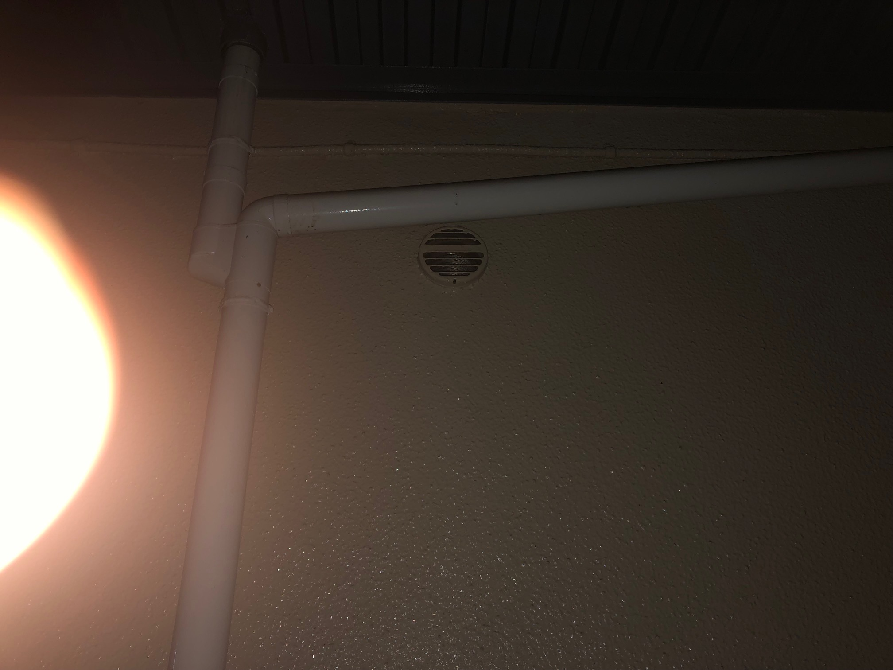

# 2026-02-02

## 換気扇 04:18

現在は、102号室の換気扇と202号室の換気扇から一日中温風が吹き出している。
以前は201号室からも一日中温風が吹き出していたが、現在は停止しているようだ。
温風は甘酸っぱい匂いがする。冷却液か？
もし、冷却液ならば、入居している闇バイトにも健康被害が及んでいる可能性がある。

* [エンジン内の液体があまーい！ 人体に猛毒の「クーラント」の正体とは | くるまのニュース](https://kuruma-news.jp/post/233264)

## GM係数管 04:19

少し前に次のGM係数感を買った。
 
* [Amazon.co.jp: Lifebasis Radiation Measuring Instrument, Water Quality Radiation Detector, Nuclear Radiation Detector Measurement, Radiation Measuring Instrument, Radiation Measuring Instrument, X-ray, Beta Ray and : Industrial & Scientific](https://www.amazon.co.jp/dp/B0CZ75GL45/ref=sspa_dk_detail_0?pd_rd_i=B0CZ75GL45&pd_rd_w=ueoK1&content-id=amzn1.sym.f293be60-50b7-49bc-95e8-931faf86ed1e&pf_rd_p=f293be60-50b7-49bc-95e8-931faf86ed1e&pf_rd_r=VDW190AEZ01Z3C6GJH8A&pd_rd_wg=ZtoZm&pd_rd_r=19440979-95cc-41ae-b125-96a45101d785&sp_csd=d2lkZ2V0TmFtZT1zcF9kZXRhaWw&th=1)
 
今の所、室内では、0.45 μSv/hが最高値になっている。
数値変化を目で確認する限り、大体、0.1 μSv/hから0.2 μSv/hの間で変動している。

## 履歴 04:48

Githubは履歴が残るので、計測結果を保存するのに適している。
今後、計測結果を保存することに活用していこう。

# 2025-06-02

## 換気扇 23:07

夕方からずっと隣室の換気扇から温風が吹き出している。

