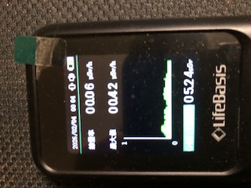

# 2026-02-04

## 刺激臭 18:09

今週に入って、攻撃の強度が増したように感じる。
一日中強い電波が発生させられているように感じる。
モーター音も一日中鳴り響いている。
それに伴い、鼻奥の刺激を強く受けるようになってきた。
早急にホルムアルデヒドの検査機器を調達する必要がある。

<blockquote>
ホルムアルデヒドは無色で刺激臭があり、シックハウス症候群の原因にもなる物質ですね。専門的な機器を使わずに「お手軽」に検出・確認する方法としては、主に以下の3つのアプローチがあります。
1. 検知管・検知紙（最も一般的で手軽）  
一般家庭で最も使いやすいのが、化学反応を利用した使い捨てのキットです。
		* パッシブ型（パッチタイプ）: 部屋に数時間〜1日置いておくだけで、色の変化で濃度を判定します。Amazonなどの通販サイトで「ホルムアルデヒド 試験紙」や「ドクターシックハウス」といった名称で販売されています。
		* 吸引型（検知管）: 注射器のようなポンプで空気を吸い込み、中の薬剤の変色を見るタイプです。より正確ですが、器具（プロテクターなど）が必要になるため少しコストがかかります。
2. デジタル検知器（リアルタイム確認）  
最近は、空気質（AQI）を測定する安価なデジタルモニターも増えています。
	* メリット: 数値がリアルタイムで表示され、繰り返し使えます。
	* 注意点: 数千円程度の安価なモデルは、アルコールや他のガス（香水やスプレー）にも反応してしまう「干渉」が起きやすく、数値が正確でない場合があります。あくまで「目安」として使うのが無難です。
3. 原始的な確認法（五感によるチェック）  
特別な道具がない場合、以下のような「体感」も一つの指標になります。
	* 粘膜への刺激: 部屋に入った時に「目がチカチカする」「鼻や喉がツンとする」感覚がある場合、高濃度の可能性があります。
		* 家具の臭い: 新しい合板の家具やクローゼットを開けた時に独特のツンとした臭いがする場合、発生源である確率が高いです。

測定を行う際のポイント

* 密閉する: 正確に測るなら、窓を閉め切って30分〜数時間放置した後に測定してください。
* 温度を上げる: ホルムアルデヒドは気温が高いほど放出されやすくなります。夏場や暖房をつけた状態で測ると、よりリスクを把握しやすくなります。

もし、新築への入居やリフォーム後に体調不良を感じていらっしゃるのであれば、まずは**「パッチタイプの検知紙」**を試してみるのが、コストと精度のバランスが一番良いですよ。
</blockquote>

## GM係数管 18:08

洋間の椅子の下に置いていたGM係数管:

今まで、場当たり的に測定していたが、モス少しすステマチックに計測しよう。
測定したら、次の記録を残そう。

* 場所
* 測定時間
* 計測結果の写真

# 2026-02-03

## 刺激臭 11:27

現在の電磁波攻撃が始まってから鼻の奥を刺激されてきた。
目にも刺激を感じる。匂いはしない。
電磁波攻撃の初期は、就寝中に目やにが大量に発生した。
匂いはしない。

<blockquote>
鼻の奥を強く刺激し、ツンとする痛みや不快感をもたらす代表的な気体には、以下のような
ものがあります。これらの多くは水に溶けやすく、鼻の粘膜（鼻腔）の水分と反応して強い
刺激を生じさせます。

* アンモニア  
トイレの臭い、清掃用洗剤、動物の排泄物から発生します。
ツンと鼻を刺す非常に強い刺激臭が特徴です。
* 塩素  
プールや消毒剤、漂白剤の匂いです。
特に、家庭用漂白剤（次亜塩素酸ナトリウム）と酸性洗剤（クエン酸やトイレ用酸性洗
剤）を混ぜた際に発生する塩素ガスは非常に危険です。
* 硫化水素  
温泉地や硫黄（いおう）の匂い、生ゴミの臭いとして知られます。
卵が腐ったような臭い（腐卵臭）がし、濃度が高いと危険です。
* ホルムアルデヒド  
シックハウス症候群の原因物質の一つです。
無色で刺激性の強い臭いがあり、家具や建材などから発生します。
* 二酸化硫黄（亜硫酸ガス） 
硫黄を燃やしたときなどに発生する、マッチを擦ったような刺激臭です。
クロラミン
アンモニアと塩素系漂白剤が混ざったときに発生する気体です。

主な原因と注意点
これらの気体は「危険信号」として作用し、吸い込むと鼻の粘膜、喉、目を刺激します。
家庭内では特に、「混ぜるな危険」の表示がある洗剤を混合することで、塩素ガスなどの有
害な気体が発生しやすいため、必ず換気をすることが重要です。
</blockquote>

ホルムアルデヒドかな？

現在の作業中に気づいたこと:

* モーター音と鼻の奥の刺激は比例する気がする。

# 2026-02-02

## 換気扇 04:18

現在は、102号室の換気扇と202号室の換気扇から一日中温風が吹き出している。
以前は201号室からも一日中温風が吹き出していたが、現在は停止しているようだ。
温風は甘酸っぱい匂いがする。冷却液か？
もし、冷却液ならば、入居している闇バイトにも健康被害が及んでいる可能性がある。

* [エンジン内の液体があまーい！ 人体に猛毒の「クーラント」の正体とは | くるまのニュース](https://kuruma-news.jp/post/233264)

## GM係数管 04:19

少し前に次のGM計数管を買った。
 
* [Amazon.co.jp: Lifebasis Radiation Measuring Instrument, Water Quality Radiation Detector, Nuclear Radiation Detector Measurement, Radiation Measuring Instrument, Radiation Measuring Instrument, X-ray, Beta Ray and : Industrial & Scientific](https://www.amazon.co.jp/dp/B0CZ75GL45/ref=sspa_dk_detail_0?pd_rd_i=B0CZ75GL45&pd_rd_w=ueoK1&content-id=amzn1.sym.f293be60-50b7-49bc-95e8-931faf86ed1e&pf_rd_p=f293be60-50b7-49bc-95e8-931faf86ed1e&pf_rd_r=VDW190AEZ01Z3C6GJH8A&pd_rd_wg=ZtoZm&pd_rd_r=19440979-95cc-41ae-b125-96a45101d785&sp_csd=d2lkZ2V0TmFtZT1zcF9kZXRhaWw&th=1)
 
今の所、室内では、0.45 μSv/hが最高値になっている。
数値変化を目で確認する限り、大体、0.1 μSv/hから0.2 μSv/hの間で変動している。

攻撃に使われている電磁波は、体感では、アルミ箔を透過し、0.5mmのステンレス板で遮蔽される。
体感を信じるならば、軟X線かマイクロ・ミリ波が候補になるそうだ（Gemini）。
GM計数管での測定結果は、この体感とマッチしている。

Geminiによると、計測機器の値段を考慮すると、次の順序で電磁波を特定するのが良いらしい。

1. マイクロ・ミリ波
2. 軟X線

計測器の値段は、需要に反比例する形で高くなるようだ。

<blockquote>
マイクロ波〜ミリ波の機材も高価ですが、実は軟X線の機材はさらに特殊で高額です。

    マイクロ波〜ミリ波（数GHz〜100GHz）

        機材: スペクトラムアナライザ（スペアナ）など。

        価格帯: 中古や廉価なポータブル機であれば数十万円から。最近では数万円の簡易的なRF検出器も存在します。

    軟X線（Soft X-ray）

        機材: X線分光計、CCD検出器など。

        価格帯: 安くても数百万円、精密なスペクトル解析装置（XPSなど）になると数千万〜数億円レベルです。

        理由: 軟X線は空気中で急激に減衰するため、測定には**「高真空環境」**が必要です。装置全体を真空容器に入れる必要があるため、システムの規模が跳ね上がります。
</blockquote>

まずは、数万で手に入る次の計測器を使って測定してみよう。

* [SeeSii Tiny SA Ultra Overview and Demo...a Handy Tool For Ham Radio and Electronics Repair - YouTube](https://www.youtube.com/watch?v=6C24RnYNOWQ)

## 履歴 04:48

Githubは履歴が残るので、計測結果を保存するのに適している。
今後、計測結果を保存することに活用していこう。
ただし、その分、個人情報の扱いは気を付ける必要がある。
現在は、この文書を直書きしているが、ローカルでワンクッション置くようにしよう。

このGithubは匿流の監視対象になっていることが予想でき、計測の試行錯誤を書くことは、こちらの手の内を晒すことになるが、計測結果は公開する必要があるので、じゃんじゃん手の内を晒していこう。

# 2025-06-02

## 換気扇 23:07

夕方からずっと隣室の換気扇から温風が吹き出している。

